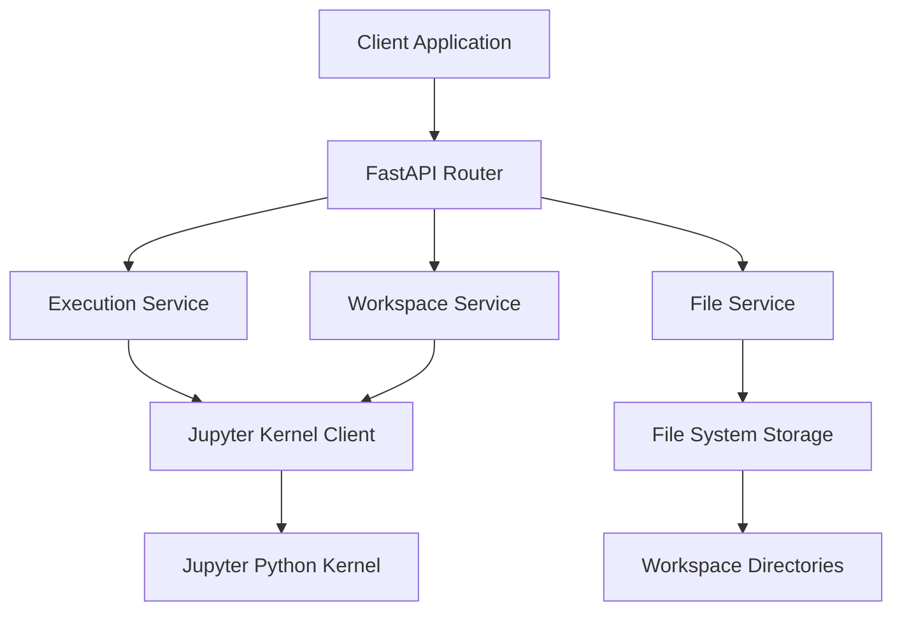
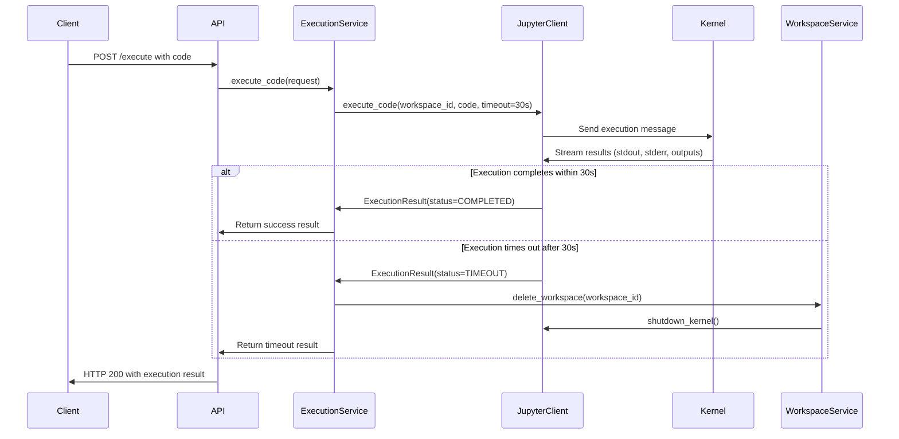

# CodeSandbox - Code Execution Service

A robust Python code execution service built with FastAPI and Jupyter kernels, providing secure sandboxed code execution with file management and timeout handling.

## 🏗️ Architecture Overview



### **Layer Responsibilities**

1. **API Layer** (`app/api/routes.py`)
   - HTTP request/response handling
   - Input validation and serialization
   - Authentication middleware

2. **Service Layer** (`app/services/`)
   - Business logic and workflow orchestration  
   - Cross-cutting concerns (logging, error handling)
   - Resource lifecycle management

3. **Infrastructure Layer** (`app/infrastructure/`)
   - Jupyter kernel communication
   - File system operations
   - External service integrations

## 🚀 Code Execution Workflow

### **1. Execution Request Flow**

```python
# Client Request
POST /workspace/{workspace_id}/execute
Content-Type: multipart/form-data
{
    "code": "print('Hello World')"
}
```

### **2. Internal Processing Pipeline**



### **3. Detailed Code Execution Steps**

#### **Step 1: Request Validation**
```python
# API validates request
- workspace_id exists
- code is valid Python string
- multipart form data properly parsed
```

#### **Step 2: Execution Service Processing**
```python
async def execute_code(request: ExecutionRequest) -> ExecutionResult:
    # 1. Generate unique execution ID
    execution_id = str(uuid.uuid4())
    
    # 2. Use server's configured timeout (30s)
    settings = get_settings_cached()
    timeout = settings.default_execution_timeout  # 30 seconds
    
    # 3. Execute via Jupyter client
    result = await self.jupyter_client.execute_code(
        workspace_id=request.workspace_id,
        code=request.code,
        timeout=timeout
    )
    
    # 4. Handle timeout status
    if result.status == ExecutionStatus.TIMEOUT:
        await self._handle_timeout_cleanup(request.workspace_id, result)
    
    # 5. Store and return result
    self._executions[execution_id] = result
    return result
```

#### **Step 3: Jupyter Kernel Communication**
```python
async def execute_code(workspace_id: str, code: str, timeout: int) -> ExecutionResult:
    kernel_client = self._get_kernel_client(workspace_id)
    start_time = datetime.utcnow()
    
    # Send code to kernel
    msg_id = kernel_client.execute(code)
    
    # Collect results with timeout
    stdout_data = []
    stderr_data = []
    
    async for msg in self._collect_execution_results(kernel_client, msg_id, timeout):
        # Process different message types
        if msg['msg_type'] == 'stream':
            if msg['content']['name'] == 'stdout':
                stdout_data.append(msg['content']['text'])
            elif msg['content']['name'] == 'stderr':
                stderr_data.append(msg['content']['text'])
        
        # Check for timeout
        elapsed = (datetime.utcnow() - start_time).total_seconds()
        if elapsed >= timeout:
            return ExecutionResult(
                status=ExecutionStatus.TIMEOUT,
                stderr=f"Execution timed out after {elapsed:.1f} seconds",
                execution_time_ms=int(elapsed * 1000)
            )
    
    # Return completed result
    return ExecutionResult(
        status=ExecutionStatus.COMPLETED,
        stdout=''.join(stdout_data),
        stderr=''.join(stderr_data),
        execution_time_ms=int(elapsed * 1000)
    )
```

## ⏱️ Timeout Handling System

### **Timeout Configuration**
```python
# config.py
default_execution_timeout = 30  # seconds
```

### **Timeout Behavior**
- **Duration**: Exactly 30 seconds (no client override)
- **Detection**: Server-side timeout monitoring
- **Action**: Immediate workspace destruction
- **Response**: Clear timeout message to client

### **Why No Interrupt Mechanism**
We **removed** kernel interrupt logic because:

1. **Unreliable**: Jupyter interrupts don't work for `time.sleep()` or infinite loops
2. **Complex**: Added unnecessary error handling and testing complexity
3. **Inconsistent**: Behavior varies across different code patterns
4. **Unnecessary**: Workspace destruction achieves the same goal reliably

### **Clean Timeout Flow**
```python
# When timeout detected (30s):
1. Stop waiting for kernel response
2. Return ExecutionResult(status=TIMEOUT)
3. Execution Service detects timeout status
4. Calls workspace_service.delete_workspace()
5. Kernel process dies during workspace cleanup
6. Return clear message: "Workspace destroyed, create new one"
```

## 🗂️ Workspace Management

### **Workspace Lifecycle**
```python
# Creation
POST /workspace/create
→ Creates isolated directory
→ Starts dedicated Jupyter kernel
→ Returns workspace_id

# Usage  
POST /workspace/{id}/execute
→ Executes code in kernel
→ Files saved to workspace directory

# Destruction (timeout/manual)
DELETE /workspace/{id} 
→ Shuts down kernel gracefully
→ Removes workspace directory
→ Cleans up resources
```

### **Workspace Isolation**
- Each workspace gets its own kernel process
- Separate file system directory
- Independent Python namespace
- No cross-workspace data access

### **File Management**
```python
# File Structure
/tmp/code_sandbox/workspaces/{workspace_id}/
├── outputs/          # Generated files (plots, data)
├── uploads/          # User-uploaded files  
└── jupyter_runtime/  # Kernel connection files
```

## 📁 File Handling System

### **Upload vs Generated Files**
The system distinguishes between user-uploaded files and code-generated files:

#### **Uploaded Files**
```python
POST /workspace/{id}/upload
→ Saved to workspace directory
→ Available for code execution
→ NOT included in generated_files response
→ Accessible via download API
```

#### **Generated Files**
```python
# Code execution creates files
plt.savefig('outputs/chart.png')
with open('data.json', 'w') as f: ...

→ Tracked in execution result
→ Included in generated_files array
→ Available for download
```

### **Download System**
```python
GET /workspace/{id}/files/{path}
→ HTTP file serving
→ Proper MIME types
→ Content-Length headers
→ 404 for missing files
```

## 🛡️ Error Handling

### **Execution Errors**
```python
# Python syntax/runtime errors
ExecutionResult(
    status=FAILED,
    stderr="NameError: name 'undefined_var' is not defined"
)
```

### **Timeout Scenarios**
```python
# Any code exceeding 30s
ExecutionResult(
    status=TIMEOUT,
    stderr="Execution timed out after 30.2 seconds\nWorkspace has been destroyed due to timeout. Create a new workspace to continue."
)
```

### **Workspace Not Found**
```python
HTTP 404: {"detail": "Workspace not found"}
```

## 🧪 Testing Strategy

### **Test Categories**

1. **Functional Tests** (`test_api.py`)
   - Complete API workflow testing
   - File upload/download verification
   - Multi-execution scenarios

2. **Timeout Tests** (`test_timeout_blocking_infinte_loops.py`)
   - Server default timeout validation (30s)
   - Workspace cleanup verification
   - Different timeout scenarios (sleep, loops, CPU)

3. **Edge Case Tests**
   - Invalid workspaces
   - Malformed requests
   - Resource cleanup

### **Test Architecture**
```python
# Test Flow
1. Create workspace
2. Execute test code
3. Verify results
4. Check file generation
5. Test downloads
6. Verify cleanup
```

## 🔧 Configuration

### **Server Settings**
```python
# app/core/config.py
class Settings:
    default_execution_timeout: int = 30  # seconds
    max_workspace_ttl_hours: int = 24
    jupyter_kernel_timeout: int = 60
    file_upload_max_size: int = 10 * 1024 * 1024  # 10MB
```

### **Environment Variables**
```bash
# Optional overrides
CODESANDBOX_TIMEOUT=30
CODESANDBOX_MAX_WORKSPACES=100
CODESANDBOX_STORAGE_PATH=/tmp/code_sandbox
```

## 🚦 API Endpoints

### **Core Endpoints**
```python
POST   /workspace/create           # Create new workspace
GET    /workspace/{id}             # Get workspace info
DELETE /workspace/{id}             # Delete workspace
POST   /workspace/{id}/execute     # Execute code
GET    /workspace/{id}/files       # List files
GET    /workspace/{id}/files/{path} # Download file
POST   /workspace/{id}/upload      # Upload file
GET    /health                     # Health check
GET    /stats                      # System statistics
```

### **Response Formats**
```python
# Execution Response
{
    "status": "completed|timeout|failed",
    "stdout": "execution output",
    "stderr": "error messages",
    "execution_time_ms": 1500,
    "generated_files": [
        {
            "filename": "chart.png",
            "relative_path": "outputs/chart.png", 
            "size": 15420,
            "mime_type": "image/png",
            "download_url": "/workspace/{id}/files/outputs/chart.png"
        }
    ],
    "result_data": {...}  # Optional structured data
}
```

## 🔍 Monitoring & Logging

### **Execution Monitoring**
- Request duration tracking
- Timeout frequency analysis  
- Success/failure rates
- Resource usage metrics

### **Log Levels**
```python
INFO  - Normal operations (workspace creation, execution completion)
WARN  - Timeouts, slow requests, resource cleanup issues
ERROR - Execution failures, system errors
DEBUG - Detailed execution flow, kernel communication
```

### **Key Metrics**
- Average execution time
- Timeout percentage  
- Active workspace count
- File generation rates
- Error patterns

## 🚨 Known Issues & Limitations

### **ZMQ Context Warnings**
```
WARNING traitlets | Could not destroy zmq context for <AsyncKernelClient object>
```
- **Impact**: Cosmetic warning only, doesn't affect functionality
- **Cause**: Forceful kernel shutdown during timeout cleanup
- **Status**: Known Jupyter limitation, workspace cleanup still succeeds

### **Timeout Limitations**
- **Infinite loops**: Cannot be interrupted, only timed out
- **Deep sleep**: `time.sleep()` operations cannot be cancelled
- **CPU-intensive**: Long computations run until timeout

### **Resource Limits**
- **Memory**: Limited by container/system memory
- **Disk**: Workspace storage bounded by filesystem
- **Concurrent executions**: One per workspace at a time

## 🛠️ Development & Deployment

### **Local Development**
```bash
# Start server
cd CodeSandbox
python run_server.py

# Run tests
python tests/test_api.py
python tests/test_timeout_blocking_infinte_loops.py
```

### **Docker Deployment**
```dockerfile
FROM python:3.11-slim
COPY . /app
WORKDIR /app
RUN pip install -r requirements.txt
CMD ["python", "run_server.py"]
```

### **Production Considerations**
- Resource monitoring and limits
- Workspace cleanup scheduling
- Log aggregation and alerting
- Health check endpoints
- Graceful shutdown handling

---

## 📚 Related Documentation

- [FastAPI Documentation](https://fastapi.tiangolo.com/)
- [Jupyter Client API](https://jupyter-client.readthedocs.io/)
- [API Testing Guide](tests/README.md)
- [Deployment Guide](deployment/README.md)

---

**Version**: 1.0.0  
**Last Updated**: July 2025  
**Maintainer**: ChatGPT Clone Development Team 