# AI System Architecture Analysis

## Table of Contents
1. [System Overview](#system-overview)
2. [Architecture Components](#architecture-components)
3. [Backend Architecture](#backend-architecture)
4. [Frontend Architecture](#frontend-architecture)
5. [Communication Patterns](#communication-patterns)
6. [Data Storage Architecture](#data-storage-architecture)
7. [Deployment Architecture](#deployment-architecture)
8. [AI Core System](#ai-core-system)
9. [Security Architecture](#security-architecture)
10. [Development Workflow](#development-workflow)

---

## System Overview

This is a comprehensive AI-powered chat application with advanced memory management, knowledge integration, and real-time streaming capabilities. The system is built with a microservices architecture using modern web technologies, featuring dual FastAPI services: the main backend for AI orchestration and a dedicated CodeSandbox service for isolated code execution.

### High-Level System Architecture

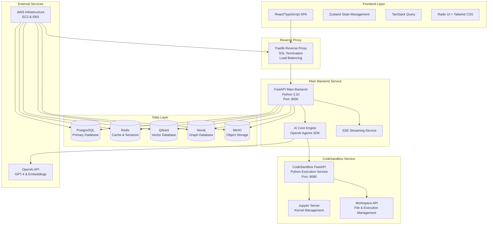

---

## Architecture Components

### Core Technologies

| Component | Technology | Purpose |
|-----------|------------|---------|
| **Frontend** | React 19.1 + TypeScript | User interface and interaction |
| **Main Backend** | FastAPI + Python 3.10 | API server and business logic |
| **Code Execution Service** | CodeSandbox FastAPI + Jupyter Server | Isolated Python execution environment |
| **AI Frameworks** | OpenAI Agents SDK + LlamaIndex | Advanced AI capabilities and RAG |
| **Authentication** | HTTP-only cookies + CSRF | Secure session management |
| **Streaming** | Server-Sent Events (SSE) | Real-time chat communication |
| **Containerization** | Docker + Docker Compose | Service orchestration |
| **Reverse Proxy** | Traefik v3.0 | SSL termination and routing |
| **Primary DB** | PostgreSQL 15+ | Structured data storage |
| **Vector DB** | Qdrant | AI embeddings and semantic search |
| **Graph DB** | Neo4j 5.26+ | Knowledge relationships |
| **Cache** | Redis 7+ | Session storage and caching |
| **File Storage** | MinIO (S3-compatible) | Document and image storage |
| **LLM Provider** | OpenAI API (GPT-4, Embeddings) | Language model and embeddings |

---

## Backend Architecture

### Service Structure

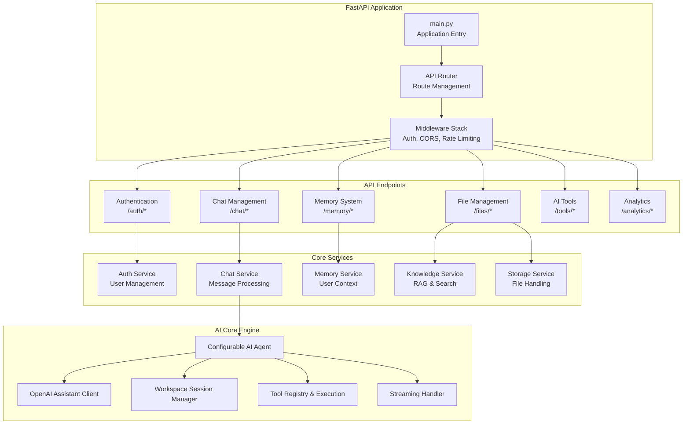

### Backend Directory Structure

```
backend/
├── app/
│   ├── main.py                 # FastAPI application entry point
│   ├── core/                   # Core configuration and shared utilities
│   │   ├── config.py          # Application configuration
│   │   ├── database.py        # Database connection management
│   │   └── security.py        # Authentication and security
│   ├── api/                    # API layer
│   │   ├── router.py          # Main API router
│   │   └── v1/                # Version 1 API endpoints
│   │       ├── endpoints/     # Route handlers
│   │       └── middleware/    # Custom middleware
│   ├── models/                 # Data models
│   │   ├── database/          # SQLAlchemy models
│   │   └── schemas/           # Pydantic schemas
│   ├── services/               # Business logic layer
│   │   ├── auth/              # Authentication services
│   │   ├── chat/              # Chat and messaging
│   │   ├── memory/            # Memory management
│   │   ├── knowledge/         # RAG and knowledge base
│   │   └── storage/           # File and media storage
│   ├── aicore/                 # AI engine core
│   │   ├── core/              # AI assistant clients
│   │   ├── agents/            # Configurable agents
│   │   ├── tools/             # AI tool implementations
│   │   └── config/            # AI system configuration
│   └── utils/                  # Utility functions
├── migrations/                 # Database migrations (Alembic)
├── docker/                     # Docker configurations
├── requirements-linux.txt      # Python dependencies
└── docker-compose.*.yml       # Container orchestration
```

---

## Frontend Architecture

### Component Architecture

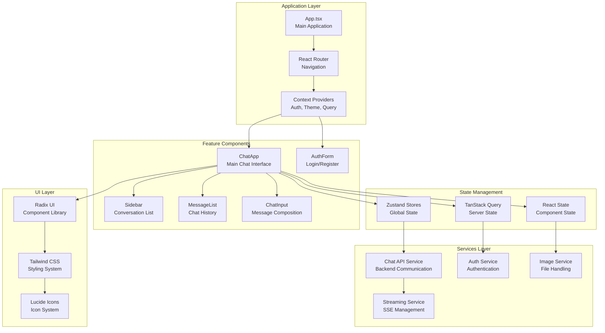

### Frontend Directory Structure

```
frontend/chatgpt-frontend/src/
├── App.tsx                     # Main application component
├── main.tsx                   # React application entry point
├── components/                # React components
│   ├── Chat/                 # Chat-related components
│   │   ├── Chat.tsx         # Main chat interface
│   │   ├── MessageList.tsx  # Message display
│   │   ├── ChatInput.tsx    # Message input
│   │   └── streaming/       # Streaming components
│   ├── Auth/                 # Authentication components
│   ├── UI/                   # Reusable UI components
│   └── common/               # Shared components
├── hooks/                     # Custom React hooks
│   ├── useChat.ts           # Chat functionality
│   ├── useAuth.ts           # Authentication
│   └── queries/             # TanStack Query hooks
├── services/                  # API and external services
│   ├── api.ts               # Base API client
│   ├── chatApi.ts           # Chat API service
│   ├── authService.ts       # Authentication service
│   └── streamingService.ts  # SSE handling
├── types/                     # TypeScript type definitions
│   ├── chat.ts              # Chat-related types
│   ├── auth.ts              # Authentication types
│   └── api.ts               # API response types
├── stores/                    # Zustand stores
├── utils/                     # Utility functions
└── config/                    # Configuration files
    └── env.ts               # Environment variables
```

---

## Communication Patterns

### Frontend-Backend Communication Flow

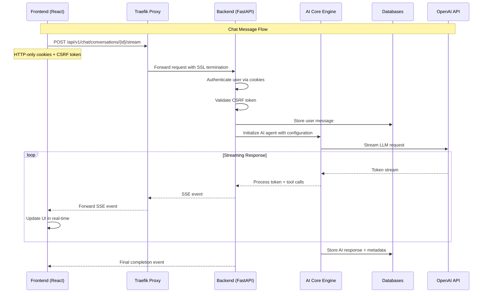

### Authentication Flow

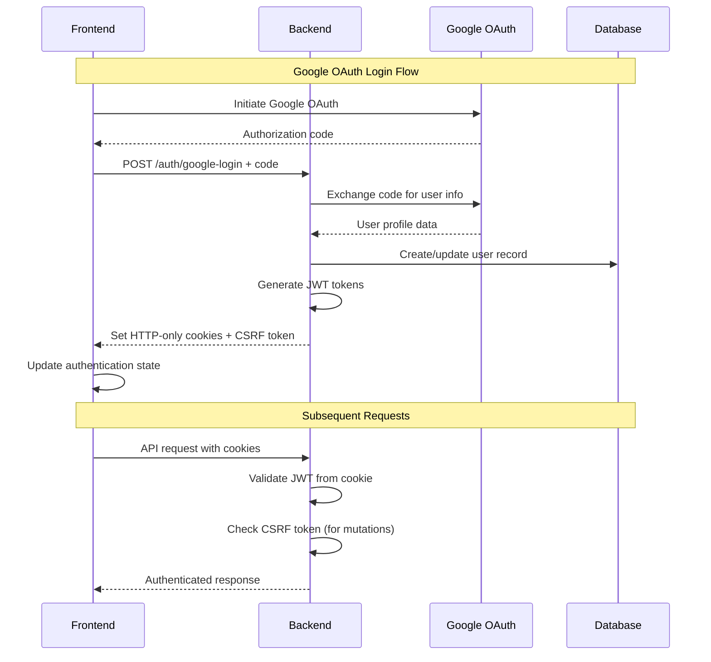

### Real-time Streaming Architecture

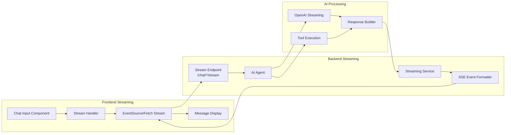

---

## Data Storage Architecture

### Database Architecture Overview

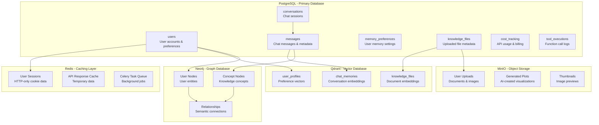

### Data Flow Patterns

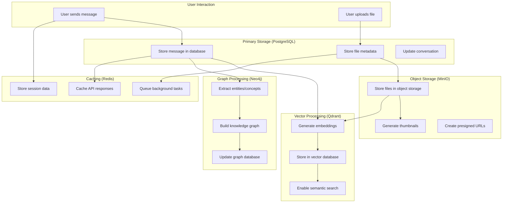

---

## Deployment Architecture

### Development Environment

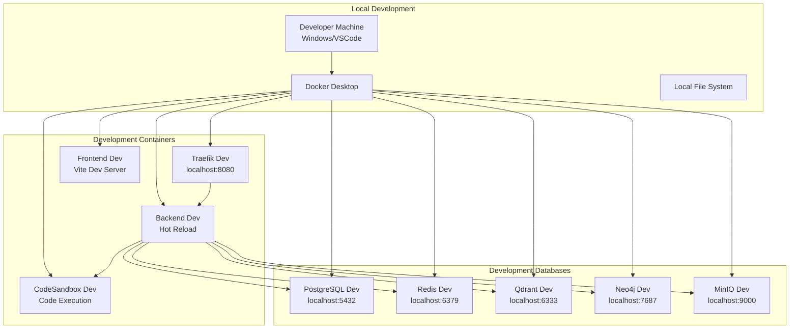

### Production Deployment (AWS)

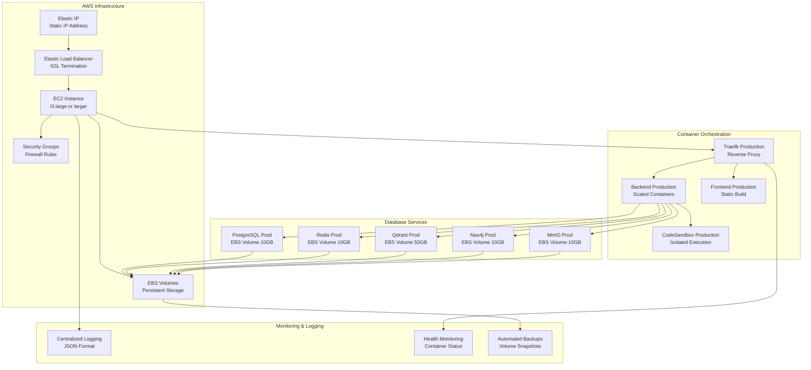

### Container Architecture

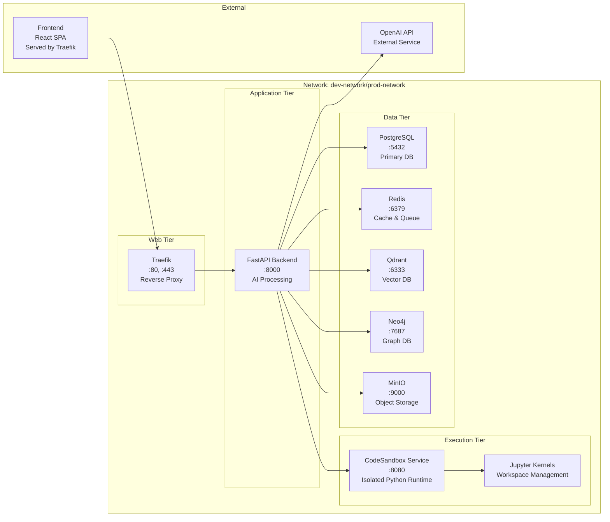

---

## AI Core System

### AI Agent Architecture

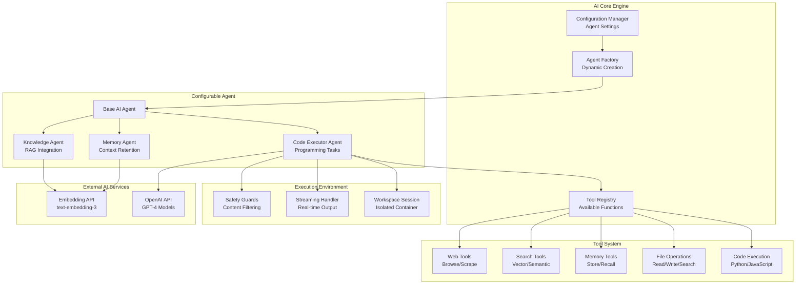

### AI Processing Flow

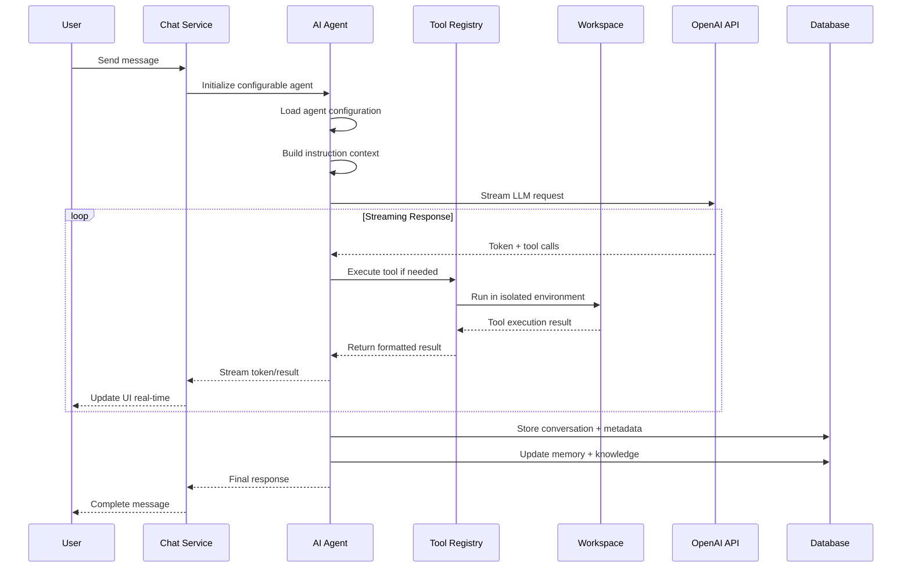

---

## Security Architecture

### Authentication & Authorization

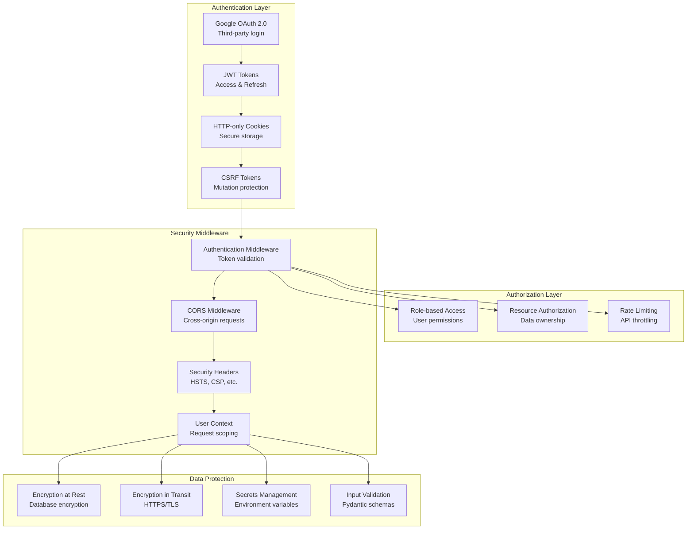

### Security Implementation

| Layer | Implementation | Purpose |
|-------|---------------|---------|
| **Transport** | HTTPS/TLS + Traefik SSL | Encrypt data in transit |
| **Authentication** | Google OAuth + JWT | Verify user identity |
| **Session Management** | HTTP-only cookies | Secure token storage |
| **CSRF Protection** | Double-submit cookies | Prevent cross-site attacks |
| **Authorization** | Role-based + resource ownership | Control access to data |
| **Input Validation** | Pydantic schemas | Sanitize user input |
| **Rate Limiting** | Redis-based throttling | Prevent abuse |
| **Container Security** | Non-root users + isolation | Limit container privileges |
| **Secrets Management** | Environment variables | Secure credential storage |
| **Data Encryption** | PostgreSQL encryption | Protect data at rest |

---

## Development Workflow

### Development Environment Setup

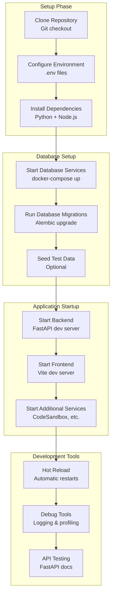

### Deployment Pipeline

```mermaid
graph LR
    subgraph "Development"
        LocalDev[Local Development<br/>Feature branches]
        Testing[Local Testing<br/>Unit & integration]
        Commit[Git Commit<br/>Version control]
    end
    
    subgraph "CI/CD Pipeline"
        BuildImages[Build Docker Images<br/>Multi-stage builds]
        RunTests[Automated Testing<br/>pytest + Jest]
        SecurityScan[Security Scanning<br/>Vulnerability check]
        ImageRegistry[Push to Registry<br/>Docker Hub/ECR]
    end
    
    subgraph "Deployment Stages"
        Staging[Staging Environment<br/>Pre-production testing]
        Production[Production Environment<br/>AWS deployment]
        Monitoring[Health Monitoring<br/>Alerts & metrics]
    end
    
    LocalDev --> Testing
    Testing --> Commit
    Commit --> BuildImages
    BuildImages --> RunTests
    RunTests --> SecurityScan
    SecurityScan --> ImageRegistry
    ImageRegistry --> Staging
    Staging --> Production
    Production --> Monitoring
```

### Configuration Management

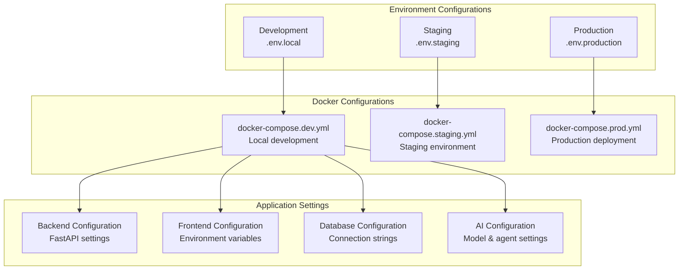

---

## AI Core System Deep Dive

### How AI Gets Its Advanced Capabilities

The AI system's sophisticated capabilities come from a multi-layered architecture combining several specialized systems:

#### 1. **Tool Registry & Execution Framework**

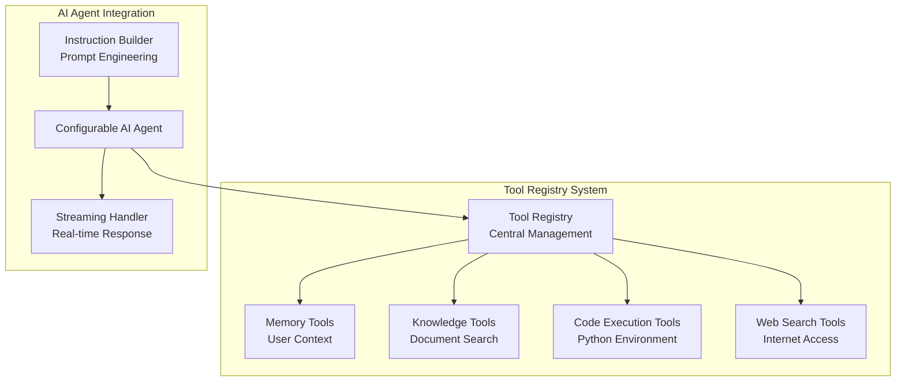

**Tool Registration Process:**

- Tools are dynamically registered at startup using factory patterns
- Each tool type (memory, knowledge, code, web) has specialized implementations
- Tools are resolved by name during agent execution
- Runtime parameters are passed to tool factories for customization

#### 2. **Code Execution Capabilities**

The AI gets its code execution powers through a sophisticated workspace system:

**CodeSandbox Service Architecture:**
The code execution system runs as a separate containerized service:

```python
# CodeSandbox Service - Isolated execution environment
class CodeSandboxService:
    """
    Dedicated service for code execution with:
    - Separate Docker container (port 8080)
    - Isolated Jupyter kernel environments per workspace
    - Persistent workspace sessions
    - Secure file system isolation
    - Resource limits and timeout controls
    - Rich output capture (plots, dataframes, images)
    """

@function_tool(strict_mode=False)
async def execute_code(workspace_id: str, code: str, timeout: int = 60):
    """
    Execute Python code via CodeSandbox service:
    - Routes to dedicated CodeSandbox container
    - Maintains persistent Jupyter kernel per workspace
    - Variables and imports persist across executions
    - Generated files saved to workspace
    - Standard output/error captured and returned
    """
```

**Key Features:**

- **Separate Container Service**: CodeSandbox runs as dedicated service on port 8080
- **Isolated Workspaces**: Each conversation gets its own workspace in the container
- **Persistent State**: Variables and imports survive between code executions within workspace
- **File Management**: Full file I/O operations with workspace-scoped persistence
- **Rich Output Support**: Matplotlib plots, pandas dataframes, images automatically captured
- **Security Sandbox**: Code execution completely isolated from main backend
- **Timeout Controls**: Prevents runaway executions with configurable limits
- **Resource Management**: Memory and CPU limits enforced at container level

#### 3. **Document Search & Knowledge Capabilities**

The AI's document processing uses a sophisticated RAG (Retrieval-Augmented Generation) system:

**Knowledge Service Architecture:**
```python
class KnowledgeService:
    """
    High-level service for knowledge file operations.
    Features:
    - Multi-format document parsing (PDF, DOCX, TXT, etc.)
    - Vector embeddings using OpenAI text-embedding-3-small
    - Semantic search with Qdrant vector database
    - Document chunking and metadata extraction
    - Query-time retrieval and ranking
    """
```

**Document Processing Pipeline:**
1. **File Upload** → Documents stored in MinIO object storage
2. **Content Extraction** → Text extracted from various formats
3. **Chunking** → Documents split into semantic chunks
4. **Vectorization** → Text converted to embeddings
5. **Storage** → Vectors stored in Qdrant with metadata
6. **Query Processing** → User queries matched against vectors
7. **Context Assembly** → Relevant chunks retrieved and ranked

**Search Modes:**
- **Conversation-wide Search**: Query all documents in a conversation
- **Specific File Search**: Target particular documents by ID
- **Semantic Similarity**: Vector-based content matching
- **Metadata Filtering**: Filter by document type, date, etc.

#### 4. **Web Search Integration**

The AI system integrates web search as a primary capability:

**Implementation Details:**
- **Priority System**: Web search is the default tool for most queries
- **Intelligent Routing**: Automatic detection of web search intent
- **Safety Measures**: Content filtering and source validation
- **Cost Controls**: Limited searches per conversation turn
- **Result Processing**: Extract and synthesize information from multiple sources

**Web Search Decision Logic:**
```python
# From prompt_utils.py - Web search is mandated by default
"""
MANDATORY: Use `web_search_preview` to verify information and get current data, EXCEPT when:
- Query needs explicit tool (code execution, document query, memory operation)
- Query is creative/fictional task that doesn't require factual accuracy
- Query contains personal/private information
- Query is follow-up/clarification in ongoing conversation
"""
```

#### 5. **Memory System Architecture**

The AI's memory capabilities use a sophisticated 6-bucket system:

**Memory Buckets:**
```python
MEMORY_BUCKETS = {
    "identity": "User's name, role, location, personal info",
    "preferences": "Communication style, tools, formats they like", 
    "goals": "Current projects, learning objectives, targets",
    "workflows": "Habits, routines, processes they follow",
    "capabilities": "Skills, experience, hardware, constraints",
    "social": "Team members, colleagues, relationships"
}
```

**Memory Operations:**

- **Storage**: Automatic extraction and storage during conversations
- **Retrieval**: Context-aware memory search and ranking
- **Importance Weighting**: 0.0-1.0 importance scoring system
- **Expiration**: Configurable memory retention policies
- **Access Patterns**: Track memory usage and update relevance

**Memory Integration in AI Responses:**
```python
async def get_essential_user_context(memory_service, user_id) -> str:
    """
    Get essential user memories formatted as a string for system prompt context.
    Only includes high-importance memories (>= 0.7) from key buckets.
    Provides AI with user background without overwhelming token budget.
    """
```

### Context Engineering & Prompt Architecture

#### 1. **Advanced Context Building System**

The AI uses sophisticated context engineering to manage conversation history:

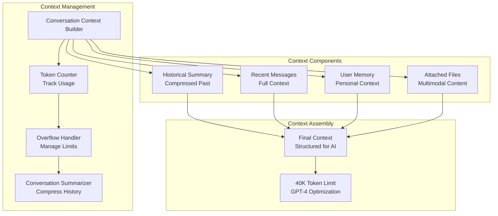

**Context Building Strategy:**
1. **Token Counting**: Every message is analyzed for token usage
2. **Overflow Detection**: When context exceeds 40K tokens, summarization triggers
3. **Intelligent Summarization**: Older messages compressed while preserving key information
4. **Recent Message Preservation**: Most recent exchanges kept in full detail
5. **Memory Integration**: User-specific context automatically included
6. **Multimodal Support**: Images and documents integrated into context

#### 2. **Sophisticated Prompt Engineering**

The system uses multi-layered prompt engineering:

**Core Prompt Structure:**
```python
# Base instruction foundation
INITIAL_CORE_PROMPT = """
You are an intelligent and helpful AI assistant. 
You always strictly use web search to improve your answers.
Core capabilities include:
- Always searching the web before giving any answer
- Answering questions with accurate, up-to-date information
- Problem-solving and strategic thinking
- Creative ideation and brainstorming
"""

# Advanced tool integration prompts
ALL_TOOLS_ENABLED_SYSTEM_PROMPT = """
🚨 MANDATORY CODE BLOCK RULE: Use exactly 4 backticks for ALL code blocks
🚨 CRITICAL - LINKS RULE: ALWAYS format links as markdown [text](url)

DEFAULT TOOL SELECTION HIERARCHY:
Step 1: Explicit Tool Cues (HIGHEST PRIORITY)
Step 2: Internet keywords → web search
Step 3: Default behavior → web search unless timeless
"""
```

**Prompt Engineering Principles:**
- **Tool Prioritization**: Clear hierarchy for tool selection
- **Safety Instructions**: Explicit rules for handling different content types
- **Formatting Standards**: Consistent output formatting requirements
- **Error Handling**: Graceful degradation when tools fail
- **Token Budget Management**: Cost-aware tool usage limits

#### 3. **Dynamic Instruction Generation**

The AI uses dynamic instruction building based on context:

```python
class InstructionBuilder:
    async def build_instructions(self, context: InstructionContext) -> str:
        """
        Build complete instructions with automatic memory context
        - Start with core prompt
        - Add user-specific memory context
        - Include tool availability information
        - Customize based on user preferences
        """
```

**Instruction Customization:**
- **User Memory Integration**: Personal context automatically included
- **Tool Availability**: Dynamic tool descriptions based on configuration
- **Preference Adaptation**: Instruction style adapted to user preferences
- **Context Sensitivity**: Instructions modified based on conversation state

### Software Engineering Practices Behind the System

#### 1. **Configuration-Driven Architecture**

The entire AI system is built around sophisticated configuration management:

```python
@dataclass
class AIConfig:
    """Complete AI system configuration"""
    agent: AgentConfig          # Agent behavior and capabilities
    model: ModelConfig          # LLM model selection and parameters
    runner: RunnerConfig        # Execution and streaming settings
    tools: ToolConfig           # Available tools and their settings
    config_version: str = "1.0" # Configuration versioning
```

**Key Practices:**
- **Centralized Configuration**: All AI behavior controlled by configuration
- **Environment-specific Settings**: Different configs for dev/staging/prod
- **Runtime Configuration Updates**: Dynamic reconfiguration without restarts
- **Validation Systems**: Configuration validation before deployment
- **Version Management**: Configuration versioning and migration support

#### 2. **Advanced Error Handling & Resilience**

The system implements comprehensive error handling:

**Error Handling Strategies:**
- **Graceful Degradation**: When tools fail, system continues with alternatives
- **Circuit Breakers**: Prevent cascade failures in tool execution
- **Retry Logic**: Automatic retry for transient failures
- **Fallback Mechanisms**: Alternative approaches when primary methods fail
- **Comprehensive Logging**: Detailed error tracking and debugging

#### 3. **Performance Optimization Practices**

**Optimization Techniques:**
- **Async Processing**: Full async/await implementation throughout
- **Connection Pooling**: Database and external service connection management
- **Caching Strategies**: Multi-level caching (Redis + in-memory)
- **Streaming Architecture**: Real-time response delivery
- **Resource Management**: Memory cleanup and garbage collection
- **Token Optimization**: Intelligent context management to minimize API costs

#### 4. **Security-First Development**

**Security Practices:**
- **Sandboxed Execution**: Code execution in isolated containers
- **Input Validation**: Comprehensive input sanitization
- **Authentication Integration**: Secure user context management
- **Audit Logging**: Complete audit trail for all operations
- **Rate Limiting**: Protection against abuse and resource exhaustion

#### 5. **Monitoring & Observability**

**Observability Features:**
- **Structured Logging**: JSON logs with correlation IDs
- **Performance Metrics**: Response times, token usage, error rates
- **Health Checks**: Comprehensive service health monitoring
- **Tracing**: Distributed tracing across service boundaries
- **Cost Tracking**: Detailed API usage and cost monitoring

---

## System Capabilities

### Core Features

| Feature | Implementation | Status |
|---------|---------------|---------|
| **Real-time Chat** | SSE streaming with OpenAI integration | ✅ Implemented |
| **Memory Management** | 6-bucket system with vector embeddings | ✅ Implemented |
| **File Processing** | Multi-format RAG with semantic search | ✅ Implemented |
| **Code Execution** | Sandboxed Jupyter kernel workspaces | ✅ Implemented |
| **Knowledge RAG** | Qdrant vector database + OpenAI embeddings | ✅ Implemented |
| **Web Search** | Mandatory web search with intelligent routing | ✅ Implemented |
| **User Authentication** | Google OAuth + HTTP-only cookies + CSRF | ✅ Implemented |
| **Multi-database** | PostgreSQL + Redis + Qdrant + Neo4j | ✅ Implemented |
| **Containerized** | Docker + Docker Compose orchestration | ✅ Implemented |
| **Production Ready** | AWS deployment + comprehensive monitoring | ✅ Implemented |

### AI Capabilities Deep Dive

#### **Core AI Technologies**
- **OpenAI Agents SDK**: Foundation for advanced reasoning and tool execution
- **LlamaIndex**: RAG framework for document processing and knowledge management
- **Qdrant Vector Database**: Semantic search and similarity matching
- **CodeSandbox FastAPI Service**: Dedicated Python execution environment with Jupyter

#### **Tool System Architecture**
- **Dynamic Tool Registry**: Runtime tool registration and resolution
- **Tool Factories**: Parameterized tool creation for different contexts
- **Tool Prioritization**: Intelligent tool selection based on user intent
- **Error Recovery**: Fallback mechanisms when tools fail
- **Resource Management**: Tool execution limits and cleanup

#### **Memory Intelligence**
- **Contextual Storage**: Automatic extraction of important information
- **Relevance Scoring**: Importance-based memory ranking (0.0-1.0)
- **Bucket Organization**: 6-category system for organized memory
- **Expiration Management**: Automatic cleanup of outdated information
- **Context Integration**: Seamless memory integration in responses

#### **Knowledge Processing**
- **Multi-format Support**: PDF, DOCX, TXT, CSV, JSON, HTML, etc.
- **Intelligent Chunking**: Semantic document segmentation
- **Vector Embeddings**: OpenAI text-embedding-3-small integration
- **Semantic Search**: Context-aware document retrieval
- **Source Attribution**: Detailed source tracking and citation

#### **Code Execution Security**
- **Workspace Isolation**: Container-based execution environments
- **State Persistence**: Variables maintained across executions
- **Output Capture**: Rich media output support (plots, tables, etc.)
- **Timeout Controls**: Execution time limits for safety
- **Resource Limits**: Memory and CPU usage constraints

#### **Web Search Integration**
- **Default Priority**: Web search as primary information source
- **Intent Detection**: Automatic routing based on query analysis
- **Source Validation**: Authority-based source ranking
- **Content Synthesis**: Multi-source information integration
- **Cost Optimization**: Query limits and result caching

### Scalability Features

- **Horizontal Scaling**: Container-based architecture supports load balancing
- **Database Optimization**: Connection pooling and indexed queries
- **Multi-level Caching**: Redis + in-memory caching strategy
- **Async Processing**: Full async/await implementation
- **Resource Management**: Memory limits and automatic cleanup
- **Stream Processing**: Real-time response delivery with backpressure
- **Load Balancing**: Traefik reverse proxy with health checks

---

## Conclusion

This AI system represents a comprehensive, production-ready chat application with advanced AI capabilities. The architecture successfully combines:

1. **Modern Web Technologies**: React/TypeScript frontend with FastAPI backend
2. **Real-time Communication**: SSE-based streaming for immediate user feedback
3. **Advanced AI Integration**: Configurable agents with tool execution capabilities
4. **Multi-database Architecture**: Optimized data storage for different use cases
5. **Security-first Design**: Comprehensive authentication and authorization
6. **Container Orchestration**: Docker-based deployment with environment parity
7. **Production Deployment**: AWS-ready infrastructure with monitoring

The system's modular design allows for easy extension and maintenance while providing a robust foundation for AI-powered applications.
