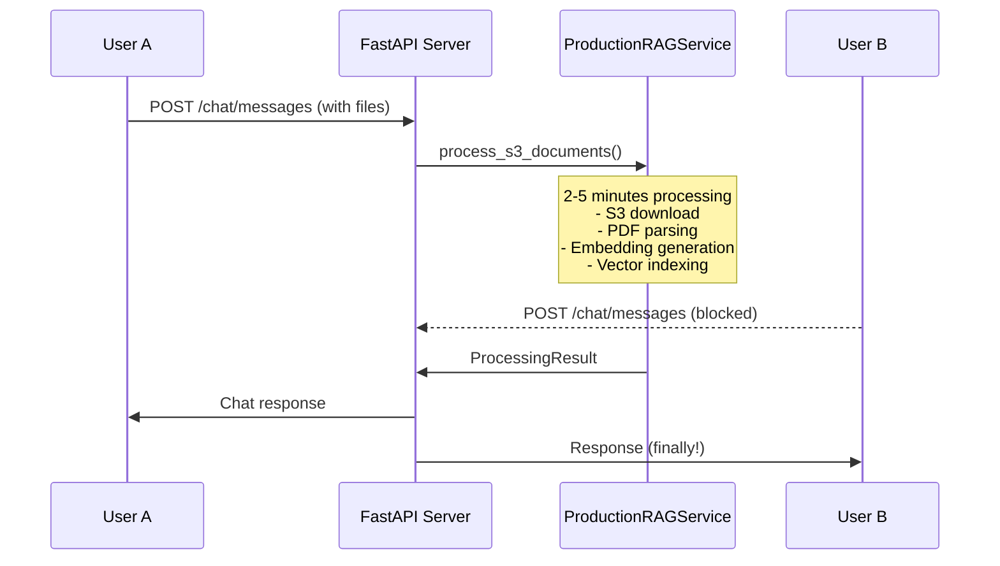
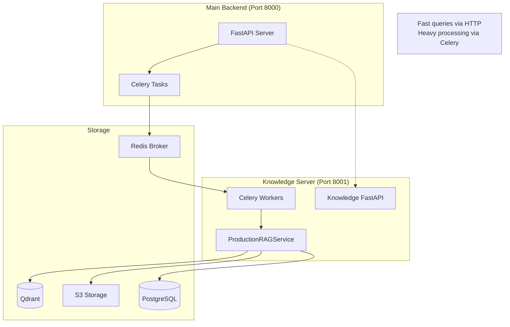

# Knowledge Service Celery Migration Plan

## 📋 Overview

This document outlines the migration of heavy document processing operations in the Knowledge Service to use Celery background tasks, preventing FastAPI server blocking and improving scalability.

## 🎯 **Recommended Architecture: Hidden Celery Integration**

**Key Innovation**: Celery is completely hidden inside `ProductionRAGService` - external code remains unchanged!

- ✅ **Zero Breaking Changes**: All existing code works exactly as before
- ✅ **Clean Architecture**: Celery is an invisible implementation detail  
- ✅ **Easy Toggle**: Switch between direct execution and Celery with one parameter
- ✅ **Same API**: Function signatures and return types unchanged
- ✅ **Production Ready**: Native Pydantic support for seamless serialization

## 🚨 Current Problem

### The Blocking Issue

When users upload documents in chat conversations, the entire FastAPI server becomes unresponsive during document processing:

- **Document Processing Time**: 30 seconds to 5+ minutes depending on file size/count
- **Server Impact**: All other API requests are blocked during processing
- **User Impact**: Other users cannot interact with the system
- **Scalability**: System cannot handle concurrent document uploads

### Current Flow (Blocking)



### Root Cause Analysis

The heavy operation is in `ProductionRAGService.process_s3_documents()`:

```python
# Lines 356-360 in production_rag_service.py
processed_nodes = await pipeline.arun(
    documents=documents,
    show_progress=self.config.show_progress,
    num_workers=self.config.num_workers
)
```

This single call performs:
- **Document parsing** (PDF/DOCX → text extraction)
- **Text chunking** (splitting into manageable pieces)
- **OpenAI API calls** (generating embeddings for each chunk)
- **Vector indexing** (creating/updating Qdrant indices)

## 🏗️ Current Architecture Analysis

### Knowledge Service Usage Patterns

The Knowledge Service is used internally in **4 key areas**:

1. **Chat Integration** (`chat/attachment_service.py`)
   - Processes vector files uploaded in chat conversations
   - Creates conversation-specific vector collections
   - Updates knowledge_files table automatically

2. **AI Agent Tools** (`knowledge/llm_knowledge_tools.py`)
   - Two function tools: `knowledge_search` and `knowledge_discovery`
   - Used by AI agents to search uploaded documents
   - Integrated into chat service for RAG capabilities

3. **Document Lifecycle** (`chat/message_service.py`)
   - Marks documents inactive when chat messages are deleted
   - Maintains document state consistency

4. **Query Utilities** (`knowledge/rag_query_util.py`)
   - Helper functions for querying conversation documents
   - Used for document-specific searches

### Key Insight

**The Knowledge Service has NO external endpoints** - it's purely internal processing during chat flow. The blocking happens during chat message processing, not via separate API calls.

## 💡 Celery Solution

### Architecture Overview

```mermaid
graph TB
    subgraph "Current Process (Blocking)"
        API1[FastAPI Server]
        RAG1[ProductionRAGService]
        API1 --> RAG1
        RAG1 --> API1
        style RAG1 fill:#ff6b6b
        note1[❌ Blocks entire server]
    end

    subgraph "Hidden Celery Solution (Recommended)"
        API2[FastAPI Server]
        subgraph "ProductionRAGService"
            PubMethod[Public Methods<br/>process_s3_documents()]
            PrivMethod[Private Methods<br/>_process_s3_documents_internal()]
            CeleryHidden[Hidden Celery<br/>Integration]
        end
        Redis[Redis Broker]
        Worker[Celery Worker]
        
        API2 --> PubMethod
        PubMethod --> CeleryHidden
        CeleryHidden --> Redis
        Redis --> Worker
        Worker --> PrivMethod
        PrivMethod --> Worker
        Worker --> Redis
        Redis --> CeleryHidden
        CeleryHidden --> PubMethod
        PubMethod --> API2
        
        style Worker fill:#51cf66
        style PubMethod fill:#e3f2fd
        style CeleryHidden fill:#f3e5f5
        note2[✅ External code unchanged<br/>Celery completely hidden]
    end
```

### Benefits of Hidden Celery Architecture

✅ **Non-blocking**: Main FastAPI server stays responsive during heavy processing  
✅ **Same UX**: Users still wait for processing (no behavior change)  
✅ **Zero Breaking Changes**: External code works exactly as before  
✅ **Scalable**: Multiple Celery workers can process documents simultaneously  
✅ **Resilient**: Worker failures don't crash main server  
✅ **Clean Architecture**: Celery is completely hidden as implementation detail  
✅ **Easy Testing**: Toggle Celery on/off with single parameter  
✅ **Maintainable**: Clear separation between public API and internal implementation

## 🎉 Celery + Pydantic Serialization

### Native Pydantic Support (Celery 5.5.0+)

The biggest advantage is that **Celery 5.5.0+ has native Pydantic support**, making serialization seamless:

#### Your Existing DataClasses Work Directly

```python
@dataclass
class ProcessingResult:
    total_requested: int
    processed_count: int
    skipped_count: int
    failed_count: int
    processing_time: float
    processed_files: List[str]
    failed_files: List[str]
    collection_id: str
    compatibility_result: Optional[CompatibilityResult] = None
    # ... all your existing fields work as-is!
```

#### What This Means

✅ **Same function signatures**: No changes to argument types  
✅ **Same return types**: ProcessingResult, QueryResult work directly  
✅ **Auto-serialization**: Celery handles dataclass ↔ JSON conversion  
✅ **Type safety**: Full type hints maintained  
✅ **No manual conversion**: No `.to_dict()` or `.from_dict()` needed

### Serialization Technical Details

#### How It Works

1. **Task Submission**: Your dataclass → JSON → Redis
2. **Worker Execution**: JSON → Your dataclass → Processing → Your dataclass
3. **Result Return**: Your dataclass → JSON → Redis → Your dataclass

#### Supported Types

✅ **Primitives**: `str`, `int`, `float`, `bool`  
✅ **Collections**: `List`, `Dict`, `Set`, `Tuple`  
✅ **Optional**: `Optional[T]`, `Union[T, None]`  
✅ **Dataclasses**: `@dataclass` decorated classes  
✅ **Pydantic Models**: `BaseModel` subclasses  
✅ **Nested Objects**: Dataclasses containing other dataclasses  

❌ **Not Supported**: `AsyncSession`, live connections, file handles, lambdas  

## 🔧 Implementation Plan

### Phase 1: Celery Setup (Day 1)

#### 1.1 Dependencies
```bash
pip install celery redis
```

#### 1.2 Celery Configuration with Pydantic Support
```python
# backend/app/celery_app.py
from celery import Celery
from app.core.config import settings

celery_app = Celery(
    "knowledge_tasks",
    broker=settings.CELERY_BROKER_URL,
    backend=settings.CELERY_RESULT_BACKEND
)

# Enable Pydantic support for seamless dataclass serialization
celery_app.conf.update(
    task_pydantic_serializer='json',  # 🎯 Key setting for Pydantic support
    result_expires=3600,  # 1 hour
    task_time_limit=1800,  # 30 minutes max per task
    worker_prefetch_multiplier=1,  # Process one task at a time
)
```

#### 1.3 Database Session for Workers
```python
# backend/app/core/database.py
def get_sync_db_session():
    """Create synchronous DB session for Celery workers"""
    from sqlalchemy import create_engine
    from sqlalchemy.orm import sessionmaker
    
    engine = create_engine(settings.DATABASE_URL.replace('+asyncpg', ''))
    SessionLocal = sessionmaker(bind=engine)
    return SessionLocal()
```

### Phase 2: Celery Tasks with Pydantic (Day 2)

#### 2.1 Document Processing Tasks
```python
# backend/app/services/knowledge/celery_tasks.py
from app.celery_app import celery_app
from app.services.knowledge.production_rag_service import ProductionRAGService, ProcessingResult
from app.services.knowledge.config import RAGConfig
from app.core.database import get_sync_db_session
import asyncio
from typing import List, Tuple

@celery_app.task(pydantic=True)  # 🎯 Magic decorator for automatic serialization
def process_s3_documents_celery(
    collection_id: str,
    s3_keys: List[str],
    user_id: str,
    force_reprocess: bool = False
) -> ProcessingResult:  # 🎉 Returns your exact dataclass directly!
    """
    Celery task for processing S3 documents.
    Runs in separate worker process to prevent FastAPI blocking.
    
    Thanks to Pydantic support: ProcessingResult is automatically serialized/deserialized
    """
    db = get_sync_db_session()
    
    try:
        # Create service instance in worker process
        rag_config = RAGConfig.for_chat_application()
        rag_service = ProductionRAGService(rag_config)
        
        # Convert async function to sync for Celery
        result = asyncio.run(rag_service.process_s3_documents(
            collection_id=collection_id,
            s3_keys=s3_keys,
            user_id=user_id,
            db=db,
            force_reprocess=force_reprocess
        ))
        
        return result  # ProcessingResult auto-serialized by Celery Pydantic support
        
    finally:
        db.close()

@celery_app.task(pydantic=True)  
def process_conversation_documents_celery(
    user_id: str,
    conversation_id: str,
    s3_keys: List[str],
    conversation_title: str = None,
    force_reprocess: bool = False
) -> Tuple[str, ProcessingResult]:  # (collection_id, result)
    """
    Celery task for processing conversation documents.
    """
    db = get_sync_db_session()
    
    try:
        rag_config = RAGConfig.for_chat_application()
        rag_service = ProductionRAGService(rag_config)
        
        # Convert async function to sync
        collection, result = asyncio.run(rag_service.process_conversation_documents(
            user_id=user_id,
            conversation_id=conversation_id,
            s3_keys=s3_keys,
            db=db,
            conversation_title=conversation_title,
            force_reprocess=force_reprocess
        ))
        
        return collection.id, result
        
    finally:
        db.close()
```

### 🔍 Technical Constraints & Solutions

#### 1. AsyncSession Problem

**Why AsyncSession can't be serialized:**
```python
# ❌ This won't work
async def process_s3_documents(
    self,
    collection_id: str,
    s3_keys: List[str],
    user_id: str,
    db: AsyncSession,  # ❌ Live database connection - can't cross process boundaries
    force_reprocess: bool = False
)
```

**The Issue:**
- `AsyncSession` is a **live database connection object**
- It's tied to the **specific process/thread** where it was created
- When Celery serializes the task, it **cannot send the live DB connection** to another process
- The worker process needs its **own database connection**

**Solution:**
```python
@celery_app.task(pydantic=True)
def process_s3_documents_celery(
    collection_id: str,
    s3_keys: List[str], 
    user_id: str,
    force_reprocess: bool = False
):
    # ✅ Create NEW DB session in the worker process
    db = get_sync_db_session()  # Fresh DB connection in worker
    
    try:
        # Now we have a valid DB session in this process
        result = asyncio.run(rag_service.process_s3_documents(
            collection_id, s3_keys, user_id, db, force_reprocess
        ))
        return result
    finally:
        db.close()
```

#### 2. Async→Sync Conversion Problem

**Why it happens:**
- **Celery workers** are **synchronous by default**
- Your `process_s3_documents` is an **async function**
- Can't directly call async functions from sync Celery tasks

**Solution (Recommended):**
```python
@celery_app.task(pydantic=True)
def process_s3_documents_celery(...):  # Sync function for Celery
    # Wrap async function call with asyncio.run()
    result = asyncio.run(  # ✅ Converts async to sync
        rag_service.process_s3_documents(...)
    )
    return result
```

#### Why These Limitations Exist

1. **Process Isolation**: Celery workers run in **separate processes** for stability
2. **Serialization**: Only **data** can cross process boundaries, not **live connections**
3. **Event Loops**: Each process has its own **asyncio event loop**

#### Bottom Line

These are **unavoidable technical constraints** when using Celery, but the workarounds are straightforward:
- **DB Session**: Create fresh connection in worker ✅
- **Async/Sync**: Use `asyncio.run()` wrapper ✅

Your core business logic stays **exactly the same** - these are just plumbing changes!

### Phase 3: Hidden Celery Integration (Day 3)

#### 3.1 Update ProductionRAGService (Clean Architecture)
```python
# backend/app/services/knowledge/production_rag_service.py
class ProductionRAGService:
    def __init__(self, config: RAGConfig, use_celery: bool = True):
        self.config = config
        self.use_celery = use_celery
        # ... existing initialization
    
    # INTERNAL async methods (renamed from existing methods)
    async def _process_s3_documents_internal(
        self,
        collection_id: str,
        s3_keys: List[str],
        user_id: str,
        db: AsyncSession,  # Async session for internal use
        force_reprocess: bool = False
    ) -> ProcessingResult:
        """
        Internal async implementation - contains your existing logic exactly as-is
        """
        collection = await self._get_or_create_collection(collection_id, db)
        
        # Load documents from S3  
        documents = await self._load_s3_documents(s3_keys, collection.collection_name)
        logger.info(f"Loaded {len(documents)} documents from S3")
        
        # Create production pipeline
        pipeline = await self.create_production_pipeline(collection, db)
        
        # Process documents using IngestionPipeline - YOUR EXISTING CODE!
        processed_nodes = await pipeline.arun(
            documents=documents,
            show_progress=self.config.show_progress,
            num_workers=self.config.num_workers
        )
        
        # ... rest of your existing processing logic unchanged
        return ProcessingResult(...)
    
    async def _process_conversation_documents_internal(
        self,
        user_id: str,
        conversation_id: str,
        s3_keys: List[str],
        db: AsyncSession,
        conversation_title: Optional[str] = None,
        force_reprocess: bool = False
    ) -> Tuple[VectorCollection, ProcessingResult]:
        """Internal async implementation - your existing logic"""
        collection = await self._get_or_create_conversation_collection(...)
        result = await self._process_s3_documents_internal(...)
        return collection, result
    
    # PUBLIC methods that hide Celery (same signatures as before!)
    async def process_s3_documents(
        self,
        collection_id: str,
        s3_keys: List[str],
        user_id: str,
        db: AsyncSession,
        force_reprocess: bool = False
    ) -> ProcessingResult:
        """
        🎯 PUBLIC API - Same signature as before, Celery hidden inside!
        External code doesn't know or care about Celery usage
        """
        if not self.use_celery:
            # Direct execution (for testing/debugging)
            return await self._process_s3_documents_internal(
                collection_id, s3_keys, user_id, db, force_reprocess
            )
        
        # 🎭 HIDDEN CELERY MAGIC - External code never sees this!
        from app.services.knowledge.celery_tasks import process_s3_documents_celery
        
        logger.info(f"🚀 Processing documents via Celery worker...")
        
        # Submit to Celery (non-blocking for other users)
        task = process_s3_documents_celery.delay(
            collection_id=collection_id,
            s3_keys=s3_keys,
            user_id=user_id,
            force_reprocess=force_reprocess
        )
        
        logger.info(f"📝 Task submitted: {task.id}")
        
        # Wait for result (user still waits - same UX!)
        result = task.get(timeout=1800)  # 30 minute timeout
        
        logger.info(f"✅ Processing complete: {result.processed_count} files")
        return result
    
    async def process_conversation_documents(
        self,
        user_id: str,
        conversation_id: str,
        s3_keys: List[str],
        db: AsyncSession,
        conversation_title: Optional[str] = None,
        force_reprocess: bool = False
    ) -> Tuple[VectorCollection, ProcessingResult]:
        """
        🎯 PUBLIC API - Same signature as before, Celery hidden inside!
        """
        if not self.use_celery:
            return await self._process_conversation_documents_internal(
                user_id, conversation_id, s3_keys, db, conversation_title, force_reprocess
            )
        
        # Hidden Celery execution
        from app.services.knowledge.celery_tasks import process_conversation_documents_celery
        
        logger.info(f"🚀 Processing conversation documents via Celery...")
        
        task = process_conversation_documents_celery.delay(
            user_id=user_id,
            conversation_id=conversation_id,
            s3_keys=s3_keys,
            conversation_title=conversation_title,
            force_reprocess=force_reprocess
        )
        
        # Get result (collection_id, ProcessingResult)
        collection_id, result = task.get(timeout=1800)
        
        # Fetch collection object for return (Celery only returned ID)
        collection = await self._get_collection_by_id(collection_id, db)
        
        return collection, result
```

#### 3.2 Update Celery Tasks (Call Internal Methods)
```python
# backend/app/services/knowledge/celery_tasks.py
@celery_app.task(pydantic=True)
def process_s3_documents_celery(
    collection_id: str,
    s3_keys: List[str],
    user_id: str,
    force_reprocess: bool = False
) -> ProcessingResult:
    """Hidden Celery task - calls internal async method"""
    db = get_sync_db_session()
    
    try:
        rag_config = RAGConfig.for_chat_application()
        rag_service = ProductionRAGService(rag_config, use_celery=False)  # No recursion!
        
        # Call INTERNAL async method (not public one to avoid recursion)
        result = asyncio.run(rag_service._process_s3_documents_internal(
            collection_id=collection_id,
            s3_keys=s3_keys,
            user_id=user_id,
            db=db,
            force_reprocess=force_reprocess
        ))
        
        return result
        
    finally:
        db.close()

@celery_app.task(pydantic=True)  
def process_conversation_documents_celery(
    user_id: str,
    conversation_id: str,
    s3_keys: List[str],
    conversation_title: str = None,
    force_reprocess: bool = False
) -> Tuple[str, ProcessingResult]:
    """Hidden Celery task for conversation documents"""
    db = get_sync_db_session()
    
    try:
        rag_config = RAGConfig.for_chat_application()
        rag_service = ProductionRAGService(rag_config, use_celery=False)
        
        # Call internal method
        collection, result = asyncio.run(rag_service._process_conversation_documents_internal(
            user_id=user_id,
            conversation_id=conversation_id,
            s3_keys=s3_keys,
            db=db,
            conversation_title=conversation_title,
            force_reprocess=force_reprocess
        ))
        
        return collection.id, result  # Return ID (collection object can't be serialized)
        
    finally:
        db.close()
```

#### 3.3 External Code Stays Unchanged! (Zero Changes Required)
```python
# backend/app/services/chat/attachment_service.py
# 🎉 NO CHANGES NEEDED - This code works exactly as before!

async def _process_vector_files(
    self,
    vector_files: List[StagingFileInfo],
    user_id: str,
    conversation_id: str,
    db: AsyncSession
) -> Optional[Dict[str, Any]]:
    """
    🎯 ZERO CHANGES - External code doesn't know about Celery!
    Same function signature, same behavior, but non-blocking for other users
    """
    if not vector_files:
        return None
    
    # Extract S3 keys
    s3_keys = [vf.s3_key for vf in vector_files]
    
    # Get RAG service - ONLY change is use_celery=True
    rag_config = RAGConfig.for_chat_application()
    rag_service = ProductionRAGService(rag_config, use_celery=True)  # ← Only change!
    
    # This call looks identical but uses Celery internally! 🎭
    collection, result = await rag_service.process_conversation_documents(
        user_id=user_id,
        conversation_id=conversation_id,
        s3_keys=s3_keys,
        db=db,
        conversation_title=None,
        force_reprocess=False
    )
    
    # Build response - same logic as before
    vector_file_references = {
        "collection_id": collection.id,
        "processed_files": [...],  # Same building logic
        "processing_result": {...}  # Same result structure
    }
    
    return vector_file_references
```

### 🎯 Hidden Celery Architecture Benefits

#### Perfect Separation of Concerns
```python
# Before: External code had to know about Celery
from app.services.knowledge.celery_tasks import process_conversation_documents_celery
task = process_conversation_documents_celery.delay(...)
result = task.get()

# After: External code stays unchanged - Celery is completely hidden!
rag_service = ProductionRAGService(rag_config, use_celery=True)
collection, result = await rag_service.process_conversation_documents(...)  # Same call!
```

#### Easy Testing and Development
```python
# Development/Testing: Disable Celery for faster feedback
rag_service = ProductionRAGService(rag_config, use_celery=False)
collection, result = await rag_service.process_conversation_documents(...)  # Direct execution

# Production: Enable Celery for scalability
rag_service = ProductionRAGService(rag_config, use_celery=True)  
collection, result = await rag_service.process_conversation_documents(...)  # Background processing
```

#### Configuration-Based Toggle
```python
# backend/app/core/config.py
class Settings:
    USE_CELERY_FOR_KNOWLEDGE: bool = Field(default=True, env="USE_CELERY_FOR_KNOWLEDGE")

# Usage in services
rag_service = ProductionRAGService(
    config=rag_config, 
    use_celery=settings.USE_CELERY_FOR_KNOWLEDGE
)
```

#### What Changes vs What Stays the Same

**✅ Stays Exactly the Same:**
- **All external code** (AttachmentService, KnowledgeService, etc.)
- **Function signatures** (no parameter changes)
- **Return types** (ProcessingResult, VectorCollection, etc.)
- **Business logic** and algorithms
- **Error handling** patterns
- **API contracts** and interfaces

**🔄 Changes Only Inside ProductionRAGService:**
- **Internal refactoring**: Split methods into public/private
- **Conditional logic**: `if use_celery` branching
- **Celery integration**: Hidden inside public methods
- **Database sessions**: Handle sync sessions in Celery tasks

**🎯 Key Benefits:**
- **Zero breaking changes**: Existing code works unchanged
- **Invisible optimization**: Celery becomes implementation detail
- **Easy rollback**: Toggle `use_celery=False` to disable
- **Clean testing**: No Celery complexity in tests

## 🚀 Deployment & Operations

### Development Setup

```bash
# Terminal 1: Start Redis
redis-server

# Terminal 2: Start Celery Worker with Pydantic support
celery -A app.celery_app worker --loglevel=info --concurrency=2

# Terminal 3: Start FastAPI Server
uvicorn app.main:app --reload

# Optional: Celery Monitoring (Terminal 4)
celery -A app.celery_app flower
# Access at http://localhost:5555 for task monitoring
```

### Production Considerations

#### Environment Variables
```bash
# .env
CELERY_BROKER_URL=redis://redis:6379/1
CELERY_RESULT_BACKEND=redis://redis:6379/1

# For production optimization
CELERY_WORKER_CONCURRENCY=4
CELERY_WORKER_MAX_TASKS_PER_CHILD=100
CELERY_TASK_TIME_LIMIT=1800  # 30 minutes
```

#### Docker Compose Updates
```yaml
# docker-compose.yml
services:
  backend:
    # existing config
    environment:
      - CELERY_BROKER_URL=redis://redis:6379/1
      - CELERY_RESULT_BACKEND=redis://redis:6379/1
    
  redis:
    image: redis:7-alpine
    ports:
      - "6379:6379"
    volumes:
      - redis_data:/data
    
  celery-worker:
    build: .
    command: celery -A app.celery_app worker --loglevel=info --concurrency=4
    depends_on:
      - redis
      - db
    environment:
      - CELERY_BROKER_URL=redis://redis:6379/1
      - CELERY_RESULT_BACKEND=redis://redis:6379/1
    volumes:
      - ./backend:/app
      
volumes:
  redis_data:
```

## 📊 Performance Impact Analysis

### Before (Blocking)
- **User A uploads 5 PDFs**: Server blocked for 3 minutes
- **User B tries to send message**: Waits 3 minutes for response
- **Concurrent users**: System unusable during processing
- **Scalability**: 1 user = entire system blocked

### After (Celery)
- **User A uploads 5 PDFs**: Still waits 3 minutes (same UX)
- **User B sends message**: Immediate response
- **Concurrent users**: No impact on other operations
- **Scalability**: Multiple users can upload simultaneously

### Resource Utilization
- **CPU**: Better distribution across processes
- **Memory**: Isolated worker processes prevent memory leaks
- **I/O**: Non-blocking for web requests
- **Database**: Proper connection pooling per process

## ✅ Implementation Timeline

### Week 1: Core Implementation (3 days)
- **Day 1**: Celery setup with Pydantic configuration
- **Day 2**: Create Celery tasks for document processing  
- **Day 3**: Update attachment service integration

### Week 2: Testing & Optimization (2 days)
- **Day 4**: Integration testing and error handling
- **Day 5**: Performance optimization and monitoring setup

### Total Effort: 5 days

## 🎯 Success Metrics

### Performance Metrics
- **Server Responsiveness**: Other API requests respond within 100ms during document processing
- **Concurrent Users**: Support 10+ users uploading documents simultaneously
- **Processing Time**: No change in document processing time (3-5 minutes)
- **Error Rate**: < 1% task failures

### Operational Metrics  
- **Worker Health**: 99% uptime for Celery workers
- **Queue Depth**: Tasks processed within 30 seconds of queuing
- **Resource Usage**: CPU/Memory usage distributed across processes

## 🔮 Future Considerations

### Separate Knowledge Server Migration

Once Celery is implemented, migrating to a separate knowledge server becomes simpler. The Celery infrastructure can be reused:

```python
# Future: Replace Celery task with HTTP call to separate server
@celery_app.task(pydantic=True)
def process_documents_via_knowledge_server(collection_id: str, s3_keys: List[str]) -> ProcessingResult:
    """
    Future: Call separate knowledge server instead of local processing
    """
    import httpx
    
    # Still uses Celery for async execution, but delegates to separate server
    with httpx.Client() as client:
        response = client.post("http://knowledge-server:8001/process", json={
            "collection_id": collection_id,
            "s3_keys": s3_keys
        })
        # Thanks to Pydantic support, can return ProcessingResult directly
        return ProcessingResult(**response.json())
```

### Hybrid Architecture (Future Recommendation)



## 🔍 **Document Processing Error Analysis**

### **FileNotDecryptedError Investigation**

During production analysis, we identified a critical document processing issue that highlights the need for better user feedback:

#### **The Problem**
```
Failed to load file /tmp/s3_docs_xxx/file_xxx.pdf with error: 
RetryError[<Future state=finished raised FileNotDecryptedError>]. Skipping...
```

#### **Root Cause Analysis**
1. **PDF Processing Failure**: LlamaIndex `SimpleDirectoryReader.aload_data()` fails when encountering:
   - Password-protected PDFs
   - Corrupted PDF files
   - Unsupported PDF encryption
   - Internal PDF format issues

2. **Silent Failure Impact**:
   - File uploaded successfully to S3 ✅
   - Processing starts normally ✅
   - PDF parsing fails silently ❌
   - Results in 0 document chunks ❌
   - No user notification of failure ❌

3. **Context Builder Behavior**:
   - Conversation context builder correctly excludes failed files from LLM context
   - Prevents AI from referencing non-existent content
   - But users don't know why their file wasn't processed

#### **Solution Requirements**
1. **Better Error Handling**: Catch `FileNotDecryptedError` and provide specific user feedback
2. **Fallback Processing**: Implement OCR fallback for problematic PDFs
3. **User Notifications**: Real-time streaming feedback during processing stages

### **LlamaIndex Async + Multiprocessing Confirmation**

Our analysis confirms that **LlamaIndex properly handles non-blocking execution** with FastAPI:

#### **How It Works**
```python
# LlamaIndex uses PROCESSES, not threads
processed_nodes = await pipeline.arun(
    documents=documents,
    show_progress=self.config.show_progress,
    num_workers=self.config.num_workers  # Creates separate processes
)
```

#### **Non-Blocking Architecture**
- **FastAPI Event Loop**: Remains free during document processing
- **Multiprocessing**: CPU-intensive work happens in separate processes
- **Async Wrapper**: LlamaIndex properly wraps multiprocessing in async calls
- **Other Users**: Can continue using the system normally

#### **Performance Characteristics**
- **User A** (processing large PDF): Waits 2-5 minutes (same UX)
- **User B** (sending text message): Gets immediate response
- **System**: Handles concurrent users without blocking

#### **Worker Optimization**
```
UserWarning: Specified num_workers exceed number of CPUs. 
Setting num_workers down to the maximum CPU count.
```
- LlamaIndex automatically optimizes `num_workers` to CPU count
- Prevents resource contention and context switching overhead
- Uses **processes**, not threads, so CPU limit makes sense

## 🔔 **Streaming User Feedback Enhancement**

### **Current Problem: Silent Processing**

Users experience **"black box" document processing** with no real-time feedback:
- Upload appears successful
- Processing happens silently for 2-5 minutes
- No indication of progress or errors
- FileNotDecryptedError happens invisibly

### **Proposed Streaming Events**

#### **Integration with Existing Streaming Handler**
```python
# Enhanced attachment processing with streaming feedback
async def _process_vector_files_with_streaming(
    self,
    vector_files: List[StagingFileInfo],
    user_id: str,
    conversation_id: str,
    db: AsyncSession,
    streaming_callback: Optional[Callable] = None  # 🆕 Add streaming support
) -> Optional[Dict[str, Any]]:
    
    if streaming_callback:
        await streaming_callback({
            "type": "file_processing",
            "stage": "starting",
            "message": f"📄 Processing {len(vector_files)} uploaded files...",
            "file_count": len(vector_files)
        })
    
    # Download and process with progress updates
    for i, vector_file in enumerate(vector_files):
        if streaming_callback:
            await streaming_callback({
                "type": "file_processing", 
                "stage": "downloading",
                "message": f"⬇️ Downloading {vector_file.filename}...",
                "current": i + 1,
                "total": len(vector_files)
            })
        
        try:
            # Process document
            result = await rag_service.process_conversation_documents(...)
            
            if streaming_callback:
                await streaming_callback({
                    "type": "file_processing",
                    "stage": "completed",
                    "message": f"✅ {vector_file.filename} processed - {result.processed_count} chunks created",
                    "chunks_created": result.processed_count
                })
                
        except FileNotDecryptedError as e:
            if streaming_callback:
                await streaming_callback({
                    "type": "file_processing",
                    "stage": "error", 
                    "message": f"❌ {vector_file.filename} failed - PDF appears to be password protected or corrupted",
                    "error": "FileNotDecryptedError",
                    "suggestion": "Please try uploading an unlocked PDF or a different file format"
                })
```

#### **Frontend Integration**
```typescript
// Enhanced streaming event handling
const handleStreamingEvent = (event: StreamingEvent) => {
  switch (event.type) {
    case 'file_processing':
      setFileProcessingStatus({
        stage: event.stage,
        message: event.message,
        current: event.current,
        total: event.total,
        error: event.error
      });
      break;
    // ... existing event handlers
  }
};
```

#### **User Experience Improvements**
- **Real-time Progress**: "Processing file 2 of 5..."
- **Stage Feedback**: "Downloading → Parsing → Creating chunks → Generating embeddings"
- **Error Notifications**: Immediate feedback about FileNotDecryptedError
- **Success Confirmation**: "✅ 15 document chunks created from your PDF"
- **Actionable Errors**: Suggestions for password-protected PDFs

### **Implementation Priority**
1. **High Priority**: Add streaming events to document processing pipeline
2. **Medium Priority**: Enhanced error handling for PDF issues
3. **Low Priority**: OCR fallback for problematic PDFs

## 📚 References

- **Celery Documentation**: https://docs.celeryq.dev/
- **Celery + FastAPI**: https://fastapi.tiangolo.com/tutorial/background-tasks/
- **Celery + Pydantic (5.5.0+)**: https://docs.celeryq.dev/en/v5.5.0/history/changelog-5.5.html
- **Production Deployment**: https://docs.celeryq.dev/en/stable/userguide/daemonizing.html
- **Flower Monitoring**: https://flower.readthedocs.io/en/latest/
- **LlamaIndex Async Processing**: https://docs.llamaindex.ai/en/stable/getting_started/async_python/
- **LlamaIndex Multiprocessing**: https://docs.llamaindex.ai/en/stable/examples/data_connectors/simple_directory_reader_parallel/

---

**Document Version**: 2.1  
**Last Updated**: August 2025  
**Status**: Ready for Implementation + Enhanced with Error Analysis  
**Architecture**: Hidden Celery Integration (Zero Breaking Changes)  
**Key Features**: 
- Native Pydantic Support for Seamless Serialization
- Complete Encapsulation - External Code Unchanged
- Production-Ready with Easy Development Toggle
- Enhanced Error Handling and User Feedback
- Confirmed Non-Blocking Architecture with LlamaIndex
