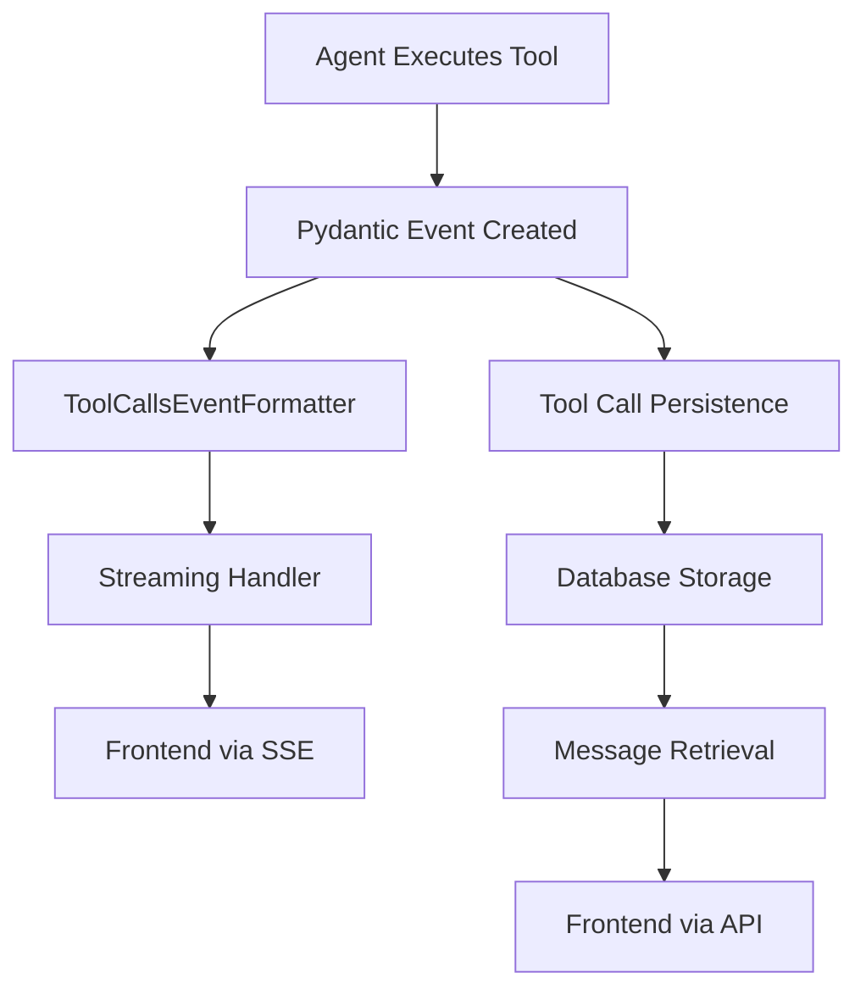

# Tool Calls Structure Documentation

This document explains the structure of tool calls as they flow from the backend to the frontend, including detailed result structures for different tool types.

## Table of Contents
- [Overview](#overview)
- [Tool Call Flow](#tool-call-flow)
- [Event Structure](#event-structure)
- [Tool Types](#tool-types)
- [Result Structures](#result-structures)
- [Frontend Integration](#frontend-integration)

## Overview

Tool calls in our system follow a structured event-based architecture that supports:
- **Streaming**: Real-time tool execution events during conversation
- **Persistence**: Tool calls are saved to the database and retrieved with messages
- **Type Safety**: Strongly typed events and results using Pydantic models
- **Extensibility**: Easy addition of new tool types through the registry system

## Tool Call Flow



## Event Structure

### Base Event Format

All tool call events sent to the frontend follow this structure:

```typescript
interface ToolCallEvent {
  tool_name: string;           // Internal tool name (e.g., "execute_code")
  display_name: string;        // Human-readable name (e.g., "Execute Code")
  tool_type: string;          // Tool category (e.g., "workspace_session_tools")
  event_type: "start" | "output"; // Event phase
  openai_tool_data: {         // Raw tool event data
    tool_id: string;          // Unique tool execution ID
    tool_name: string;        // Tool name
    tool_type: string;        // Tool type enum
    timestamp: string;        // Auto-generated ISO timestamp
    arguments?: any;          // Tool arguments (start events only)
    result?: any;             // Tool result (output events only)
    status?: string;          // Tool status (output events only)
  };
}
```

### Tool Start Event

```json
{
  "tool_name": "execute_code",
  "display_name": "Execute Code",
  "tool_type": "workspace_session_tools",
  "event_type": "start",
  "openai_tool_data": {
    "tool_id": "call_abc123",
    "tool_name": "execute_code",
    "tool_type": "FUNCTION_CALL",
    "timestamp": "2025-01-06T10:30:45.123456",
    "arguments": {
      "workspace_id": "ws_abc123",
      "code": "print('Hello World')"
    }
  }
}
```

### Tool Output Event

```json
{
  "tool_name": "execute_code",
  "display_name": "Execute Code", 
  "tool_type": "workspace_session_tools",
  "event_type": "output",
  "openai_tool_data": {
    "tool_id": "call_abc123",
    "tool_name": "execute_code",
    "tool_type": "FUNCTION_CALL",
    "timestamp": "2025-01-06T10:30:45.123456",
    "result": {
      "success": true,
      "execution_result": {
        "execution_id": "exec_def456",
        "workspace_id": "ws_abc123",
        "status": "completed",
        "stdout": "Hello World\n",
        "stderr": "",
        "execution_time_ms": 150
      }
    },
    "status": "COMPLETED"
  }
}
```

## Tool Types

Our system supports three main categories of tools:

### 1. Code Execution Tools (`workspace_session_tools`)
- `create_workspace` - Create isolated code execution environment
- `upload_file` - Upload files to workspace
- `execute_code` - Execute Python code in workspace

### 2. Knowledge Tools (`knowledge_tools`)
- `user_uploaded_documents_query` - Search uploaded files and documents
- `list_user_uploaded_documents` - List available knowledge files

### 3. Memory Tools (`memory_tools`)
- `retrieve_user_memory` - Get user memories and context
- `save_user_memory` - Save new user memories

## Result Structures

### Code Execution Results

#### Successful Execution
```json
{
  "success": true,
  "execution_result": {
    "execution_id": "exec_abc123",
    "workspace_id": "ws_def456", 
    "status": "completed",
    "started_at": "2025-01-06T10:30:45.000000",
    "completed_at": "2025-01-06T10:30:45.150000",
    "stdout": "Hello World\nResult: 42\n",
    "stderr": "/tmp/warning: deprecated function\n",
    "outputs": [],
    "result_data": null,
    "generated_files": [
      {
        "filename": "output.png",
        "size": 15420,
        "mime_type": "image/png",
        "download_url": "/workspace/ws_def456/files/output.png",
        "relative_path": "output.png"
      }
    ],
    "execution_time_ms": 150
  },
  "error": null
}
```

#### Failed Execution
```json
{
  "success": false,
  "execution_result": null,
  "error": "Code execution failed: NameError: name 'undefined_var' is not defined"
}
```

#### Workspace Creation
```json
{
  "success": true,
  "workspace": {
    "workspace_id": "ws_abc123",
    "status": "ready",
    "created_at": "2025-01-06T10:30:45.000000",
    "expires_at": "2025-01-06T11:30:45.000000"
  },
  "error": null
}
```

#### File Upload
```json
{
  "success": true,
  "file_info": {
    "filename": "data.csv",
    "size": 2048,
    "mime_type": "text/csv",
    "workspace_path": "/workspace/data.csv",
    "upload_time_ms": 45
  },
  "error": null
}
```

### Knowledge Tool Results

#### Document Search
```json
"**Query:** What are the main conclusions?

**Files Searched:** All files in conversation (3 files available)

**Answer:** Based on the uploaded documents, the main conclusions are:

1. The quarterly revenue increased by 15% compared to the previous quarter
2. Customer satisfaction scores improved significantly in the mobile app category
3. The new marketing strategy shows promising early results

**Sources:** 5 source chunks found in 0.245s

**Source Details:**
1. Q4_Report.pdf (Score: 0.892) - Page 12
2. Customer_Survey.pdf (Score: 0.834) - Page 3
3. Marketing_Analysis.pdf (Score: 0.781) - Page 7"
```

#### Document Discovery
```json
"**Available Knowledge Files (3 files):**

1. **Q4_Report.pdf**
   - Knowledge File ID: `kf_abc123`
   - Documents: 1
   - Chunks: 45
   - Size: 2048576 bytes
   - Type: application/pdf
   - Processed: 2025-01-06T09:15:30.000000

2. **Customer_Survey.pdf**
   - Knowledge File ID: `kf_def456`
   - Documents: 1
   - Chunks: 23
   - Size: 1024000 bytes
   - Type: application/pdf
   - Processed: 2025-01-06T09:20:15.000000

**Usage:** Use `search_knowledge_files()` with specific `knowledge_file_ids` to search individual files, or set `search_all_files=true` to search all files."
```

### Memory Tool Results

#### Memory Retrieval
```json
"User memories (showing 8 total memories):

1. [IDENTITY] John Smith, Senior Software Engineer, Pacific timezone
2. [PREFERENCES] Prefers concise explanations with practical code examples
3. [PREFERENCES] Uses VS Code with Python and TypeScript primarily
4. [GOALS] Learning React for upcoming project deadline in March
5. [WORKFLOWS] Follows TDD approach, writes tests before implementation
6. [CAPABILITIES] 8+ years Python experience, familiar with FastAPI and Django
7. [SOCIAL] Works with team lead Sarah and junior dev Mike
8. [PREFERENCES] Likes dark mode interfaces and minimal UI designs"
```

#### Memory Update
```json
"Memory saved to preferences bucket: 'Prefers TypeScript over JavaScript for new proj...' (importance: 0.80)"
```

## Frontend Integration

### TypeScript Interface

```typescript
interface ToolExecution {
  tool_id: string;
  display_name: string;
  tool_name: string;
  tool_type: string;
  status: 'started' | 'running' | 'completed' | 'error';
  timestamp: string;
  message_id?: string;
  progress_data?: any;
  error?: string;
  error_details?: any;
  stderr?: string; // For code execution warnings
  openai_tool_data?: {
    tool_id?: string;
    arguments?: any;
    result?: any;
    status?: string;
    timestamp?: string;
  };
}
```

### Streaming Events

The frontend receives tool events via Server-Sent Events (SSE):

```javascript
// Tool execution starts
{
  "type": "tool_call_start",
  "data": {
    "tool_name": "execute_code",
    "display_name": "Execute Code",
    "tool_type": "workspace_session_tools",
    "openai_tool_data": {
      "tool_id": "call_abc123",
      "timestamp": "2025-01-06T10:30:45.123456",
      "arguments": { "workspace_id": "ws_abc", "code": "print('test')" }
    },
    "stream_id": "stream_xyz789"
  }
}

// Tool execution completes
{
  "type": "tool_call_output", 
  "data": {
    "tool_name": "execute_code",
    "display_name": "Execute Code",
    "tool_type": "workspace_session_tools", 
    "openai_tool_data": {
      "tool_id": "call_abc123",
      "timestamp": "2025-01-06T10:30:45.123456",
      "result": { "success": true, "execution_result": {...} },
      "status": "COMPLETED"
    },
    "stream_id": "stream_xyz789"
  }
}
```

### Message Persistence

Tool calls are also saved to the database and retrieved with messages:

```json
{
  "message_id": "msg_abc123",
  "role": "assistant",
  "content": "I'll execute that code for you.",
  "tool_calls": [
    {
      "tool_name": "execute_code",
      "display_name": "Execute Code",
      "tool_type": "workspace_session_tools",
      "event_type": "start",
      "openai_tool_data": {
        "tool_id": "call_abc123",
        "timestamp": "2025-01-06T10:30:45.123456",
        "arguments": {...}
      }
    },
    {
      "tool_name": "execute_code", 
      "display_name": "Execute Code",
      "tool_type": "workspace_session_tools",
      "event_type": "output",
      "openai_tool_data": {
        "tool_id": "call_abc123",
        "timestamp": "2025-01-06T10:30:45.123456", 
        "result": {...},
        "status": "COMPLETED"
      }
    }
  ]
}
```

## Key Points

### Timestamps
- **Auto-generated**: All tool events get automatic server-side timestamps via Pydantic models
- **Preserved**: Frontend preserves the original start timestamp when correlating start/output events
- **Format**: ISO 8601 format in UTC (`YYYY-MM-DDTHH:mm:ss.ffffff`)

### Error Handling
- **Stderr vs Error**: Code execution can have `stderr` (warnings) with `success: true`, or `error` with `success: false`
- **Status Mapping**: Backend status maps to frontend display (completed/error/started)
- **Graceful Degradation**: Missing fields are handled with sensible defaults

### Tool Registry
- **Dynamic**: Tools are registered automatically through `ToolsInfo` classes
- **Display Names**: Snake_case tool names converted to readable display names
- **Type Safety**: Strong typing throughout the pipeline with Pydantic models

This structure ensures consistent, type-safe tool execution with comprehensive error handling and real-time streaming capabilities.